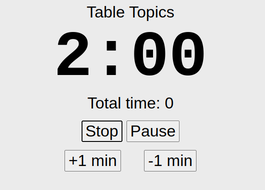

# Description
This is a simple countdown timer to be used at toastmasters, or for practice at home.

It can time Table Topics, Icebreakers, Speeches, Evaluations, General Evaluations and 1-Minute silence.

Access the app here: https://sslater11.github.io/toastmasters-timekeeper-app

### It shows the green, amber and red card.

   

### Flashes after the speaker reaches their time limit.

 

### It also keeps a log of all speech times, see the bottom of the screen.

# Usage
Open the page "toastmasters-timekeeper-app.html" on your phone's web browser.

You can also click this link https://sslater11.github.io/toastmasters-timekeeper-app

Rotate phone to landscape and pinchy zoom to resize the numbers to fit the screen to your liking.

Choose Table Topics, Icebreaker, Speech, Evaluation or General Evaluator and 1-Minute Silence(for evaluators and judges).

Press the start button.

Once stop is presed, you will see a log of all times captured at the bottom of the screen.

To reset the page on a phone/tablet, swipe down to refresh the webpage, clearing the log of times.

You can use the 'Demo mode' option to demonstrate the coloured cards to an audience.

When you select a different speech type, it will show you the green, amber and red light times for you to announce to the audience.

# License
MIT
You can freely share or modify this for personal, business and corporate use :).

# Version
3.1 - 01/12/24
